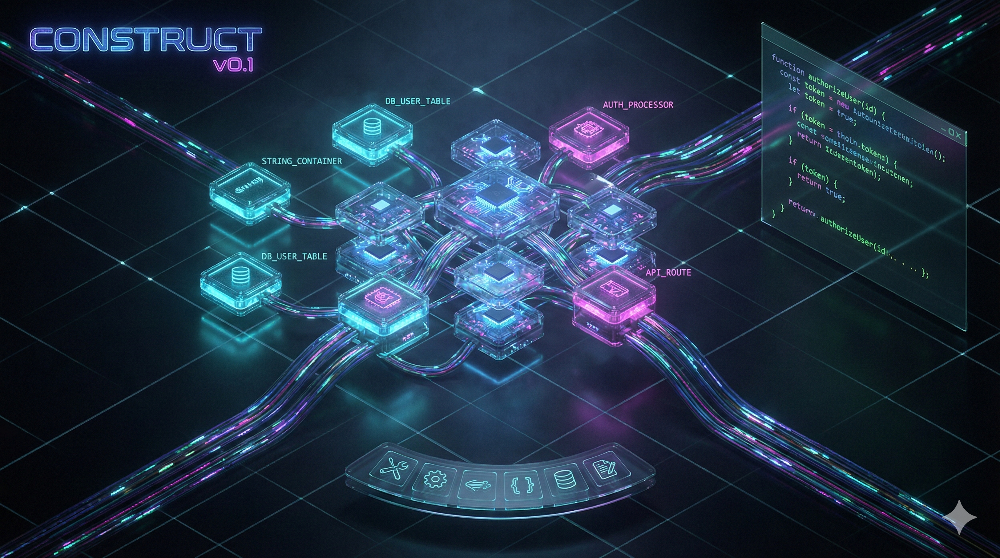
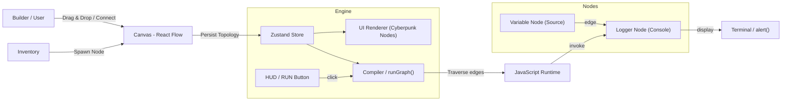

# CONSTRUCT

<p align="center">
  
</p>

<p align="center"><strong>Construct — A spatial, graph-first IDE that visualizes application architecture as interactive nodes and flows.</strong></p>


### Rethinking the IDE

> **"We are building software in 2026 using metaphors from 1970."**

---

## 📜 Our Perspective

For decades, software development has centered around text files and file-based workflows. Those tools are powerful, but they can make it difficult to reason about complex systems when relationships are expressed only by paths and imports.

Construct explores an alternative: a spatial, graph-based interface where code, data, and connections are represented as nodes and wires. This approach emphasizes structure and discoverability, helping teams visualize data flow and architecture more clearly.

Construct does not seek to discard existing tools overnight. Instead, it provides a complementary way to design and understand systems — a "post-file" paradigm focused on architecture and clarity.

---

## 🔮 The Vision

Imagine an IDE where you don't "open a file," you **enter a room**.

* **The Canvas:** An infinite, dark-mode spatial grid where your application lives.
* **The Nodes:** Functions, variables, and components are physical objects you can touch, drag, and group.
* **The Wires:** Data flow is visible. You don't "import" a module; you plug a cable into it.
* **The Inventory:** You don't edit `package.json`. You open your inventory and equip "React" or "Tailwind" like a weapon in an RPG.

We are gamifying development not to make it "fun," but to make it **manageable**. By using spatial memory and visual feedback, we reduce cognitive load by 90%.

---

## ⚡️ The Architecture

Construct operates on a **"Headless Graph"** architecture. The state of the application is not text; it is a JSON graph stored in memory.

### High-Level Data Flow



### The Tech Stack

* **Core:** React + Vite (The Host)
* **Visual Engine:** React Flow v12 (The Physics & Canvas)
* **State Machine:** Zustand (The "No-File" Database)
* **Aesthetics:** Tailwind CSS + Framer Motion (The "Juice")

---

## 🗺 The Roadmap

We are currently in **Phase 1: The Spark**. We need your help to reach The Inferno.

### 🟢 v0.1: The Spark (Current MVP)

* [x] Infinite Canvas Setup
* [x] "The Void" Dark Theme
* [ ] **Variable Node:** A glass container for strings/numbers.
* [ ] **Logger Node:** A terminal output for debugging.
* [ ] **The Compiler:** Basic graph traversal (`Input` -> `Output`).

### 🟡 v0.2: The Flow (Logic)

* [ ] **Math Nodes:** Add, Subtract, Multiply.
* [ ] **Logic Nodes:** If/Else gates (visualized as split tracks).
* [ ] **The Inventory:** A radial menu to spawn nodes (drag-and-drop).

### 🔴 v0.3: The Forge (Components)

* [ ] **Function Containers:** Group nodes into a "Black Box" reusable component.
* [ ] **Minimap:** A radar view of your huge code city.

### 🟣 v1.0: The Construct (Persistence)

* [ ] **Local Save:** Persist graphs to `localStorage` or SQLite.
* [ ] **Export to JS:** One-click export your visual graph to a valid `.js` file for production.

---

## 🤝 We Need You.

This is an ambitious project. We are trying to kill the text editor, and we cannot do it alone.

We are looking for **Believers**:

* **Frontend Architects:** Who love 60fps interactions and smooth physics.
* **Compiler Nerds:** Who want to figure out how to turn a JSON graph into an AST.
* **Designers:** Who dream in Cyberpunk, Neon, and Glassmorphism.

**If you find this project valuable, please consider starring this repository.** ⭐
A star helps others discover this work and supports ongoing development.
If you find Construct useful, we welcome contributions — from documentation and small fixes to new features.

**Join us.**

---

## 🛠 Development Setup

Ready to enter the Construct?

### Prerequisites

* Node.js v20+ (recommended)
* Familiarity with Node and npm or yarn

### Quick Start

1. **Clone the Repo**
```bash
git clone https://github.com/MuhammadShamim/construct-ide.git
cd construct-ide

```


2. **Install the Tools**
```bash
npm install

```


3. **Enter the Grid**
```bash
npm run dev

```


Open `http://localhost:5173` and witness the future.

---

### 🧪 Testing

We rely on **Interaction Testing**.

1. **Spawn** a Data Node.
2. **Connect** it to a Logger Node.
3. **Run**.
If the alert pops up, the Engine is healthy.

---

*Built with passion by [Muhammad Shamim] and the Construct Community.*